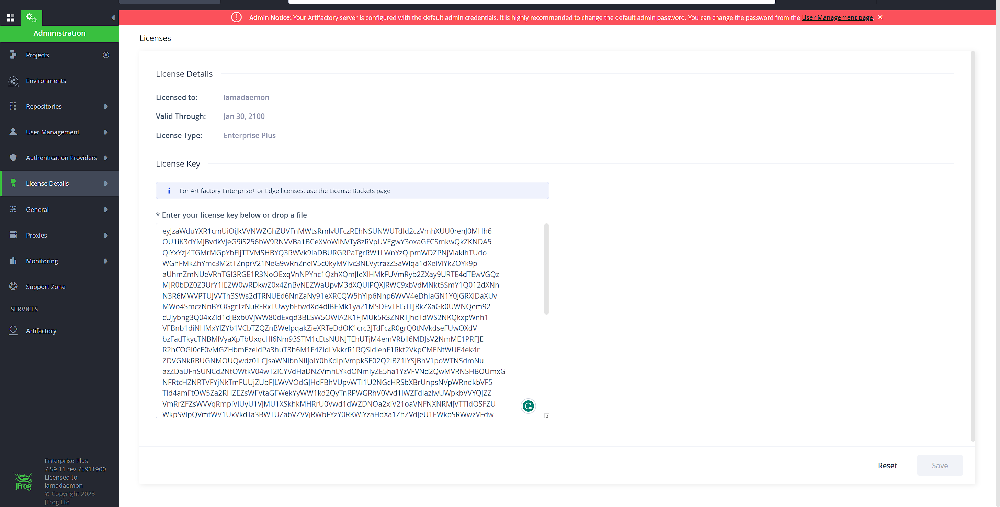

# ArtifactoryKeygen

As it's named, this project is a keygen of Artifactory from JFrog. 

Tested on 7.104.6 (Latest version), 7.9.2 (Latest version on [releases-docker](https://releases-docker.jfrog.io/))

If you think this project is useful to you please leave a star! Thanks!

**ALERT!! _YOU SHOULD NEVER USE THIS PROJECT TO CRACK / PATCH / ILLEGAL USE ANY SOFTWARE FROM JFROG_**

**ALERT!! _THIS PROJECT IS FOR EDUCATIONAL PURPOSES!_**

**ALERT!! _THE CONSEQUENCES CAUSED BY THE USE OF THIS SOFTWARE SHALL BE BORNE BY THE USER_**

[](https://996.icu)
[](https://github.com/996icu/996.ICU/blob/master/LICENSE)
---

Click for different languages of this file
- [English](README.MD)
- [简体中文](README_CN.MD)

Table of Contents
- [ArtifactoryKeygen](#artifactorykeygen)
    * [0x00 Installation](#0x00-installation)
    * [0x01 Configuring the keygen [Optional]](#0x01-configuring-the-keygen--optional-)
    * [0x02 Configuring the agent [Optional]](#0x02-configuring-the-agent--optional-)
        + [Override default public key](#override-default-public-key)
            - [By using the keygen](#by-using-the-keygen)
            - [By your hands](#by-your-hands)
    * [0x03 Other useful tools](#0x03-other-useful-tools)
        + [Keygen](#keygen)
    * [0x04 Compilation](#0x04-compilation)
    * [0x05 TODOs and Future updates](#0x05-todos-and-future-updates)



## 0x00 Installation

Download `ArtifactoryKeygen` and `ArtifactoryAgent` both from Github Releases

Run `ArtifactoryKeygen` with Java 11 or above.

```shell
$ java -jar /path/to/ArtifactoryKeygen-1.0-SNAPSHOT-all.jar [sub-command]
```

> Leaving sub-command empty will eventually prompt you to enter a sub-command later

Use the`gen` sub-command to generate a license

Of course, the license generated by Keygen cannot be used directly.
You'll need `ArtifactoryAgent` to patch some files.

Navigate to Artifactory's Tomcat folder then edit `bin/setenv.sh` (It should be named `setenv.bat` on Windows)

Add the following line to that file. Don't forget to change the path!
```shell
# Linux / macOS(But why macOS??)
CATALINA_OPTS=-javaagent:/path/to/ArtifactoryAgent-1.0-SNAPSHOT-all.jar
```

```batch
:: Windows
SET CATALINA_OPTS=-javaagent:path\to\ArtifactoryAgent-1.0-SNAPSHOT-all.jar
```

DON'T FORGET: **_YOU SHOULD NEVER USE `Artifactory` ILLEGALLY_**

## 0x01 Configuring the keygen

*Currently, this is not supported. I may add this feature future.*

## 0x02 Configuring the agent

Currently, override the default public key is the only configurable entry.

### Override default public key

First, you need to generate a proper configuration using Keygen, although you can do it manually.

#### By using the keygen

Run the keygen with the sub-command 'mkconfig' and then enter your public key.

To be noticed that the public key should be a **RSA Public Key in X509 Format**
and have at least 4096 bits of modulus of the key

Copy the generated text and put it in agent arguments like this:
```shell
# Linux
CATALINA_OPTS=-javaagent:/path/to/ArtifactoryAgent-1.0-SNAPSHOT-all.jar=<GeneratedConfigHere>
```

```batch
:: Windows
SET CATALINA_OPTS=-javaagent:/path/to/ArtifactoryAgent-1.0-SNAPSHOT-all.jar=<GeneratedConfigHere>
```

The configuration should be in hexadecimal format with all letters capitalized

#### By your hands

Edit the template below and use Base64 to encode it then convert the encoded result into a hexadecimal string with all letters capitalized.

```XML
<config>
    <publicKey>Your public key here</publicKey>
</config>
```

You can get any text hexadecimal-ized by passing your text into the agent (Yes the agent is executable!)


```
$ java -jar /path/to/ArtifactoryAgent-1.0-SNAPSHOT-all.jar <Text>
```

Also, you can generate a proper key pair(RSA 4096) with the `genkey` sub-command in Keygen

## 0x03 Other useful tools

### Keygen

You can retrieve all available sub-commands by using the sub-command 'help'

I'm lazy to write a help again so I copied from the sub-command 'help'

```kotlin
println("""
    List of all sub-commands:
        obf <text>:
            Obfuscate text with JFrog's 'ObfuscatedString' class
        pub:
            Get the current public key (RSA)
        pri:
            Get the current private key (RSA)
        genkey:
            Generate a key pair
        gen:
            Generate a license with the current private key
        verify <license>:
            Verify a license with the current public key
        enc: [ NOT TESTED ]
            Encrypt a license (I guess this is used for the license of the old version)
        verifyAgent:
            You can verify ArtifactoryAgent by attaching the agent to ArtifactoryKeygen
        mkconfig:
            Create agent config but friendly!
    To inject into artifactory
        Open Artifactory's tomcat folder and add the following JVM options to tomcat.
        In case you don't know how to pass extra JVM args you can see the README of this project
        OR Google it by yourself!
        
        -javaagent:</path/to/this/jar/file>
        
        his will patch class 'org.jfrog.license.api.a'
                    
""".trimIndent())
```

## 0x04 Compilation

Compiling the code might be a little different compared to other gradle projects.

You will notice that I've used a library from JFrog which looks like not a public one.
So I decided not to upload it. However, you can extract it from `artifactory.war`

I assume that you are familiar with web development with Java and SpringFramework.
So there will be no tutorial here about how to extract it.
If you meet any problem while extracting google first!

After extracting the necessary libraries you should put them into `libs`.
If those libraries have changed their version don't forget to update in `build.gradle.kts`

To compile the code and pack a jar file with all dependencies use the following gradle task

```shell
# Root project (Keygen)
$ gradlew :shadowJar
```

```shell
# Agent
$ graldew :ArtifactoryAgent:shadowJar
```

**_PRs are always welcome! Thanks for your contributions to this project!_**

## 0x05 TODOs and Future updates

- [ ] Code Cleanup
- [ ] Add more configurables to both Keygen and Agent
- [ ] Artifactory version detection
- [ ] Migrate from `artifactory-addons-manager` to `LicenseManager` (Which is a de-obfuscated version of `artifactory-addons-manager`)
- [ ] Chinese version of README.MD
